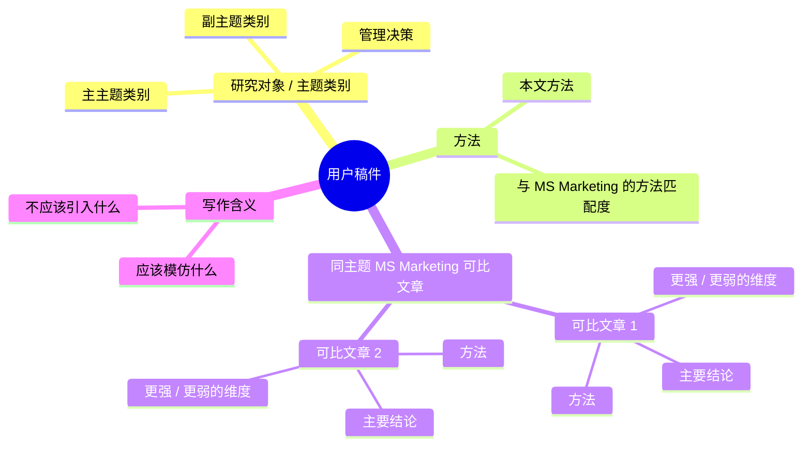

# MS MKT Publish

[English](#english) | [中文](#中文)

## English

An AgentSkill named `ms-mkt-publish` for writing and revising analytical marketing theory manuscripts in a Management Science Marketing style. By default, substantive outputs are in Chinese, while article titles, journal names, variables, equations, citation keys, and precision-sensitive technical terms remain in English when needed.

The skill helps an AI writing agent imitate the reusable structure of Management Science Marketing articles at three levels:

- topic-class routing
- method and comparable-paper benchmarking
- Chinese positioning benchmarks and Mermaid mind maps
- whole-paper architecture
- paragraph function
- sentence role

It is designed for theory-heavy manuscripts where the draft needs to read less like a proof package and more like a publishable marketing paper: concrete phenomenon first, managerial puzzle second, formal model third, and memorable design implications throughout.

## Mind Map Example



## What It Does

Use this skill to:

- rewrite abstracts, introductions, model sections, result sections, and managerial implications;
- turn technical propositions into marketing-facing design boundaries;
- identify the manuscript's general MS Marketing topic class before selecting reference articles;
- identify the manuscript's method and compare it with same-topic Management Science Marketing articles;
- summarize comparable papers' methods and conclusions, then judge where they are stronger or weaker on named dimensions;
- start substantive outputs with a six-part Chinese positioning benchmark: research object/topic class, manuscript method, closest same-topic Management Science Marketing comparables, comparable methods, comparable conclusions, and dimension-specific better/worse diagnosis;
- draw a compact Chinese Mermaid mind map when multiple comparables or topic-method relationships need to be shown visually;
- imitate same-topic articles through sentence-role traces rather than generic templates;
- map a manuscript onto a Management Science Marketing article structure;
- diagnose whether a section reads like an acceptance-oriented marketing theory paper;
- translate abstract model primitives into concrete marketing decisions, consumer states, constraints, and managerial diagnostics.

The skill does not promise journal acceptance. It gives the agent a stricter writing workflow aimed at the standards and style of Management Science Marketing theory articles.

## Repository Structure

```text
.
|-- SKILL.md
`-- references
    |-- section-architecture.md
    |-- topic-router-and-close-imitation.md
    `-- sentence-templates.md
```

`SKILL.md` is the entry point. It defines when the skill should trigger and the core workflow.

`references/section-architecture.md` contains whole-paper and section-level structures.

`references/topic-router-and-close-imitation.md` contains the topic-class router and same-class close imitation protocol.
It also contains the method classifier and comparable-paper benchmark format.

`references/sentence-templates.md` contains sentence-role templates for openings, puzzles, research questions, literature gaps, contributions, propositions, welfare, and managerial implications.

## Installation

Clone or copy this folder into your Codex skills directory:

```bash
cd ~/.codex/skills
git clone git@github.com:zcxzju/ms-marketing-sentence-imitation.git
```

Then restart or refresh Codex so the skill metadata is loaded.

## Example Prompts

```text
Use ms-mkt-publish to rewrite my introduction for Management Science Marketing.
```

```text
Audit this Analysis section and tell me whether it reads like an MS Marketing theory paper.
```

```text
Imitate Management Science Marketing article structure paragraph by paragraph for this manuscript.
```

```text
First identify what type of MS Marketing topic this is, then imitate articles in the same category sentence by sentence.
```

```text
Tell me what method this paper uses, what same-topic MS Marketing papers use, what they conclude, and whether they are better or worse than us.
```

```text
Turn these propositions into reader-friendly marketing design rules.
```

## Design Principle

The skill imitates structure, function, and rhetorical moves. It should not copy wording from published papers.

The preferred writing order is:

```text
phenomenon -> managerial puzzle -> model primitive -> benchmark -> mechanism -> policy rule -> welfare or managerial boundary -> robustness
```

When possible, translate notation into marketing objects:

- model primitives -> firm decisions or consumer states
- constraints -> managerial tradeoffs
- comparative statics -> design boundaries
- optimized regimes -> actionable policy rules

## 中文

一个名为 `ms-mkt-publish`、用于撰写和修改 Management Science Marketing 部门解析建模/理论论文的 AgentSkill。

默认输出为中文；论文题名、期刊名、作者名、变量、公式、引用键和不宜翻译的技术术语会在必要时保留英文。

这个 skill 帮助 AI 写作代理在三个层级模仿 Management Science Marketing 文章的可复用写法：

- 主题类别识别
- 方法与同类文章基准比较
- 中文定位基准与 Mermaid 思维导图
- 整篇文章结构
- 段落功能
- 句子角色

它适合理论味较重的稿件，尤其是那些需要从“证明包”改成“可投稿营销论文”的草稿：先讲真实营销现象，再讲管理困惑，然后引入 formal model，并持续把技术结果翻译成审稿人容易记住的设计含义。

## 思维导图示例


## 功能

使用这个 skill 可以：

- 改写 abstract、introduction、model section、result section 和 managerial implications；
- 把技术性 proposition 改写成面向 marketing reader 的设计边界；
- 先识别稿件属于哪类 MS Marketing 主题，再选择同主题参考文章；
- 识别稿件使用的方法，并和同类 Management Science Marketing 文章的方法比较；
- 总结同类文章的方法和结论，再判断它们在哪些维度比我们强或弱；
- 所有实质性输出先给出六项中文定位基准：研究对象/主题类别、本文方法、最接近的同主题 Management Science Marketing 可比文章、可比文章方法、可比文章结论、与本文相比更强/更弱的维度；
- 当涉及多个可比文章或主题-方法关系时，画出紧凑的中文 Mermaid 思维导图；
- 通过句子角色轨迹模仿同主题文章，而不是套通用句型；
- 将一篇 manuscript 映射到 Management Science Marketing 的文章结构；
- 诊断某一节是否读起来像 MS Marketing 理论文；
- 把抽象模型参数翻译成具体的营销决策、消费者状态、约束条件和管理诊断。

这个 skill 不承诺文章一定被接收。它提供的是一个更严格的写作流程，使文章更接近 Management Science Marketing 理论文的审稿期待和写作风格。

## 仓库结构

```text
.
|-- SKILL.md
`-- references
    |-- section-architecture.md
    |-- topic-router-and-close-imitation.md
    `-- sentence-templates.md
```

`SKILL.md` 是入口文件，定义 skill 何时触发以及核心工作流。

`references/section-architecture.md` 包含整篇文章和章节层级的结构模板。

`references/topic-router-and-close-imitation.md` 包含主题分类路由和同主题贴身模仿流程。
它也包含方法分类和同类文章基准比较格式。

`references/sentence-templates.md` 包含 opening、puzzle、research question、literature gap、contribution、proposition、welfare 和 managerial implication 的句子角色模板。

## 安装

把这个仓库 clone 或复制到你的 Codex skills 目录：

```bash
cd ~/.codex/skills
git clone git@github.com:zcxzju/ms-marketing-sentence-imitation.git
```

然后重启或刷新 Codex，让 skill metadata 被重新加载。

## 示例 Prompt

```text
Use ms-mkt-publish to rewrite my introduction for Management Science Marketing.
```

```text
Audit this Analysis section and tell me whether it reads like an MS Marketing theory paper.
```

```text
Imitate Management Science Marketing article structure paragraph by paragraph for this manuscript.
```

```text
先识别这篇稿子属于哪类 MS Marketing 主题，再逐句模仿同类文章。
```

```text
判断这篇文章用的什么方法，同类 MS Marketing 文章用什么方法、有什么结论、比我们好还是差。
```

```text
Turn these propositions into reader-friendly marketing design rules.
```

## 设计原则

这个 skill 模仿的是结构、功能和修辞动作，不复制已发表论文的原文措辞。

推荐写作顺序是：

```text
phenomenon -> managerial puzzle -> model primitive -> benchmark -> mechanism -> policy rule -> welfare or managerial boundary -> robustness
```

在可能的情况下，这个 skill 会鼓励把符号翻译成 marketing objects：

- model primitives -> firm decisions or consumer states
- constraints -> managerial tradeoffs
- comparative statics -> design boundaries
- optimized regimes -> actionable policy rules
