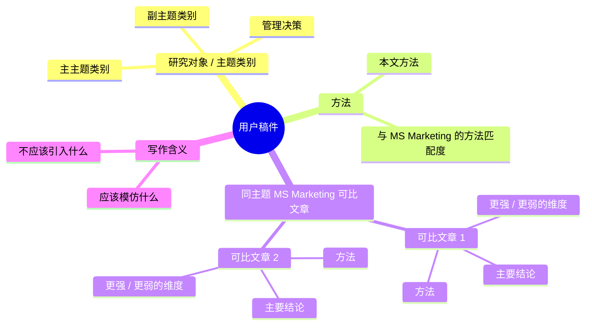

# MS MKT Publish

## Core Rule

Default to Chinese output. Unless the user explicitly asks for English, write all diagnoses, section labels, tables, recommendations, explanations, and Mermaid mind-map labels in Chinese. Keep article titles, journal names, citation keys, author names, model variables, equations, and established technical terms in English when translating them would reduce precision.

Write like a Management Science Marketing theory paper, not like a proof package. Imitate reusable paper architecture, paragraph function, and sentence role; do not copy source-paper wording.

Never guarantee acceptance. Aim for an acceptance-oriented draft by making the marketing phenomenon real, the managerial decision explicit, the theoretical mechanism memorable, and the result order reviewer-friendly.

For imitation tasks, first classify the manuscript's topic class, then imitate same-class MS Marketing articles. Do not default to BlindBox/FOMO templates unless the manuscript's topic actually fits digital goods, stochastic products, social comparison, or retention.

For any substantive audit, rewrite, outline, or imitation task, start with the mandatory positioning benchmark before giving the requested rewrite or advice. The benchmark must answer six questions in order: (1) what topic class / research object the manuscript belongs to, (2) what method it uses, (3) which same-topic Management Science Marketing articles are the closest comparables, (4) what methods those comparables use, (5) what conclusions they reach, and (6) whether each comparable is stronger or weaker than the user's manuscript on clearly named dimensions. When there are at least two comparables or the user asks for a visual, include a compact Mermaid mind map.

## First Move

1. Inspect live artifacts before rewriting.
   - If the user gives a manuscript path, read section headings, abstract, introduction, model setup, propositions, figures, and result summaries.
   - If the user points to `/Users/chenxi/obsidian/MS_marketing`, list notes and PDFs there, search title fragments with `find` or `rg`, and prefer the user's notes over memory.
   - Translate abstract model objects into concrete marketing decisions, consumer states, constraints, and observable managerial diagnostics.

2. Classify the topic before choosing templates.
   - Read `references/topic-router-and-close-imitation.md` when the user asks for imitation, rewrite, positioning, introduction revision, or article-template selection.
   - Assign one primary topic class and, if needed, one secondary class.
   - Identify the manuscript's method: analytical game theory, dynamic model, search model, information design, structural/empirical, experiment, field data, numerical analysis, or mixed method.
   - Select local same-topic reference articles before using generic MS Marketing sentence templates.
   - For each comparable, state its method, core conclusion, and whether it is better or worse than the user's manuscript on topic fit, method fit, result punch, managerial relevance, and writing clarity.
   - Prefer comparables from Management Science Marketing. If the closest same-topic article is from Marketing Science, OR, economics, or another field, label it as adjacent rather than presenting it as same-department evidence.
   - Use "better" and "worse" only dimension-by-dimension. Do not rank a paper as globally better or worse.

3. Decide the imitation level.
   - Whole paper: use section architecture and result ordering.
   - Introduction: use the 8-paragraph MS Marketing introduction sequence.
   - Section rewrite: use paragraph function labels before drafting.
   - Sentence polish: imitate the sentence role, transition logic, clause order, and level of concreteness of same-class articles; do not reproduce their wording.

4. Keep the output manuscript-facing.
   - Lead with phenomenon, managerial puzzle, and mechanism.
   - Put equations after the economic object is named.
   - State propositions as design boundaries or comparative rules.
   - Move long derivations, tie cases, and exhaustive case splits to appendix language.

## Reference Files

Read only what the task needs:

- `references/topic-router-and-close-imitation.md`: use first for theme classification, reference-article selection, and sentence-by-sentence close imitation within the matched topic class.
- `references/section-architecture.md`: use for whole-paper outline, section ordering, result sequence, extensions, and assumption-discussion placement.
- `references/sentence-templates.md`: use for introduction paragraphs, contribution paragraphs, related-literature bridges, model-section prose, proposition lead-ins, and managerial implication sentences.

## Workflow

1. Build the mandatory positioning benchmark.
   - Which topic class does it belong to: pricing/dynamic demand, search/discovery, targeting/data, social influence/networks, platform/marketplace, digital goods/games, information design/persuasion, or welfare/regulation?
   - What is the research object: price, search path, targeting/data, exposure, platform rule, digital product design, information environment, regulation, or welfare?
   - What method does the manuscript use, and is that method common among same-topic Management Science Marketing papers?
   - Which same-topic Management Science Marketing papers are the closest comparables?
   - What methods do those comparables use?
   - What do those comparables conclude?
   - Where is the user's manuscript stronger, weaker, or differently positioned?
   - Is the first screen a real marketing practice?
   - Is the research question a firm/platform decision rather than a parameter exercise?
   - Is the behavioral or information primitive connected to a meaningful firm decision, consumer response, market outcome, or welfare implication?
   - Does every result answer a managerially named tradeoff?

2. Draw a compact mind map when useful.
   - Use Mermaid `mindmap` for a quick visual if the output discusses multiple topic classes, methods, or comparables.
   - Put the user's manuscript as the root node.
   - Branch into topic class, method, same-topic comparables, comparable conclusions, and relative strengths/weaknesses.
   - Keep labels short and manuscript-facing; do not make the mind map a citation dump.

3. Build a section-function map.
   - For each section or paragraph, assign one function: phenomenon, puzzle, research question, model primitive, benchmark, mechanism, optimal policy, welfare wedge, extension, assumption defense, or managerial diagnostic.
   - Delete or move text that has no function in the section.

4. Draft in sentence roles.
   - Start paragraphs with the role sentence, not a citation list or formula.
   - Use one paragraph for one move.
   - After technical statements, add one interpretive sentence that says what the condition means for marketing practice.

5. Audit for acceptance-facing risks.
   - Too technical before the puzzle is clear.
   - Purely mathematical novelty without marketing decision content.
   - Literature review written as a list instead of a sequence of gaps.
   - Results named by notation rather than design implications.
   - Extensions that look like a second paper instead of robustness or boundary conditions.

## Output Shapes

Default first block for all substantive outputs:

```text
定位基准：
1. 研究对象 / 主题类别：
2. 本文使用的方法：
3. 最接近的同主题 Management Science Marketing 可比文章：
4. 这些可比文章使用的方法：
5. 这些可比文章的主要结论：
6. 与本文相比，哪些维度更强 / 更弱：
对写作 / 改写的含义：
```

When a visual helps, add a compact Chinese Mermaid mind map after the benchmark:



For a quick rewrite:

```text
定位基准：
1. 研究对象 / 主题类别：
2. 本文使用的方法：
3. 最接近的同主题 Management Science Marketing 可比文章：
4. 这些可比文章使用的方法：
5. 这些可比文章的主要结论：
6. 与本文相比，哪些维度更强 / 更弱：
段落 / 小节功能：
MS-style 改写：
为什么这更接近 Management Science Marketing：
```

For a full writing plan:

```text
1. 研究对象与主题分类
2. 方法分类
3. 同主题 MS Marketing 可比文章表：文章、研究对象、方法、结论、在哪些维度比我们强 / 弱
4. 主题-方法-可比文章思维导图
5. 参考文章层级
6. 目标文章结构
7. 引言段落地图
8. 逐节模仿地图
9. 命题 / 结果顺序
10. 相关文献桥接句
11. 管理启示诊断
12. 应该移到 appendix 的内容
```

For direct TeX edits, patch the manuscript and then run a compile check when the project has a known compile command.
